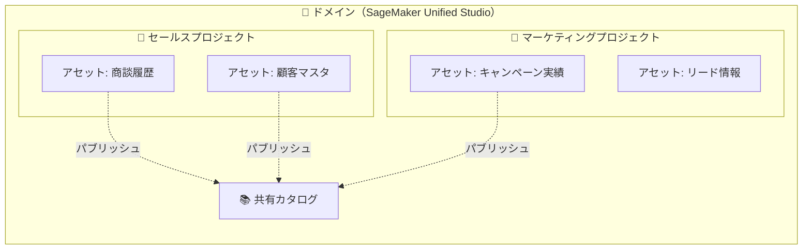
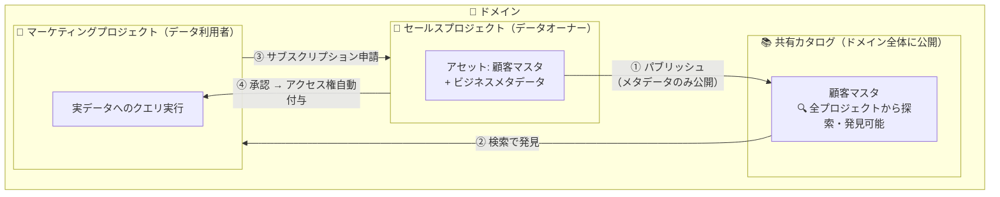
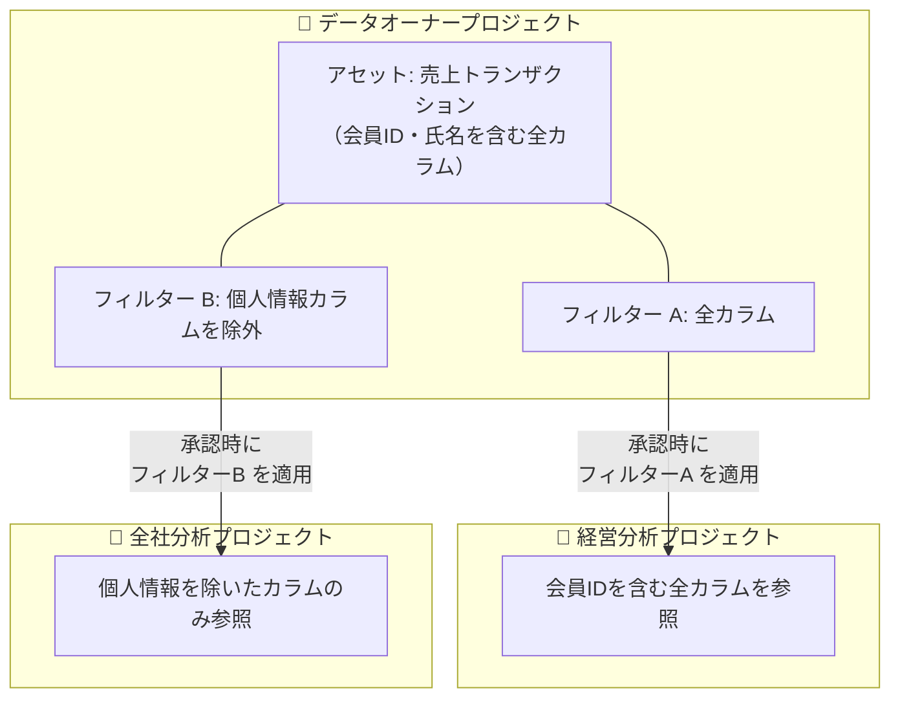

## はじめに

本記事は、SageMaker Unified Studio（旧 DataZone）を使ったデータカタログ構築の入門記事です。そもそも「アセット」とは何か、なぜ必要なのかといった概念の整理から始め、最終的に **AWS CLI を使って Glue テーブルからアセットを作成する** ところまでを記載します。

「Unified Studio を触り始めたけれど、アセットという言葉が出てきてもピンとこない」「Glue テーブルを Unified Studio のカタログに登録したいが、どういう仕組みで、どんな準備が必要なのか分からない」といった方に向けた内容です。

### この記事で解説すること

- アセットとは何か（Glue テーブルとの関係、ビジネスコンテキストの役割）
- ドメイン・プロジェクト・アセットの関係性、パブリッシュとサブスクリプションの仕組み
- なぜアセットが必要なのか（データコラボレーション / データガバナンス / Data Agent 活用）
- Lake Formation 権限などの前提条件
- AWS CLI を使って Glue テーブルからアセットを作成する具体的な手順（データソース作成 → データソースラン実行 → アセット確認）

### 想定読者

- SageMaker Unified Studio（DataZone）を使い始めた、あるいはこれから使う予定のデータエンジニア・データ基盤担当者
- Glue Data Catalog のテーブルを Unified Studio のカタログで管理・共有したい方
- アセット・ドメイン・プロジェクトといった概念を整理したい方

### 前提知識

- AWS の基本的な操作（IAM、AWS CLI）
- Glue Data Catalog（データベース / テーブル）の基礎知識
- Lake Formation の概要（権限管理の考え方）を知っていると理解がスムーズです

## アセットとは?

SageMaker Unified Studio（DataZone）における「[アセット](https://docs.aws.amazon.com/ja_jp/datazone/latest/userguide/datazone-concepts.html#datazone-terms)」とは、テーブルやビューなどの**データオブジェクトに対応するカタログ上の管理単位**です。

- Glue テーブル 1 つ = アセット 1 つ
- アセットにはビジネス名、Description、グロサリー用語、メタデータフォーム等のビジネスコンテキストを付与できる
<!-- - パブリッシュすると Unified Studio ドメイン全体のユーザーがカタログ検索で発見可能になる (実データの参照にはサブスクリプションが必要)
  - 次の章で解説しています。 -->
- 実データではなく、**メタデータの管理単位**

#### 具体例: Glue テーブル `sales_transactions` をアセット化した場合

例えば、Glue Data Catalog 上に `sales_transactions` というテーブルがあるとします。このテーブルをアセットとして登録し、ビジネスコンテキストを付与すると以下のようになります。

| 項目 | テクニカル情報（Glue 側） | ビジネスコンテキスト（アセット側で付与） |
|------|--------------------------|----------------------------------------|
| **名前** | `sales_transactions` | 売上トランザクション |
| **説明** | *(なし)* | EC サイトにおける全注文の売上明細データ。1 行 = 1 注文明細。返品・キャンセルを含む |
| **グロサリー用語** | — | 「売上」「注文」「トランザクション」 |
| **カラム: `txn_amt`** | DOUBLE 型 | ビジネス名: 取引金額（税込）、説明: 消費税込みの決済金額（日本円） |
| **カラム: `cust_id`** | STRING 型 | ビジネス名: 顧客 ID、説明: 顧客マスタの主キーと結合可能 |
| **メタデータフォーム** | — | データオーナー: セールスチーム、更新頻度: 日次、PII 有無: なし |

このように、テクニカルなテーブル名やカラム名だけでは分からない「このデータは何を意味するのか」「誰が管理しているのか」「どう使えるのか」といったビジネス上の文脈を付与できるのがアセットの役割です。

なお、Glue テーブル/ビューだけでなく、以下のような対象にアセットを作成することも可能です。

| 対象 | 補足 |
|--------|-----------|
| Redshift テーブル/ビュー | None |
| S3 オブジェクトコレクション | Amazon S3 バケット/プレフィックス内のオブジェクト集合 |
| 機械学習リソース | SageMaker モデル、パイプライン、学習用データセット、Jupyter Notebook 等 |
| BI / 可視化ダッシュボード | Amazon QuickSight, Tableau, Power BI 等のレポート |

SageMaker Unified Studio でのアセットの役割を理解する上で、**ドメイン**と**プロジェクト**との関係性の理解が必要ですが、以下のようなイメージになります。



| 概念 | 説明 |
|------|------|
| **ドメイン** | 組織全体のデータガバナンスの最上位単位 |
| **プロジェクト** | ドメイン内のチーム単位の作業空間。アセットの所有権、IAM ロール、接続情報がプロジェクトに紐づく |
| **アセット** | プロジェクトに所属するカタログ上の管理単位。パブリッシュによりドメイン内の全プロジェクトに公開される |

### プロジェクト分割の方針

[プロジェクト](https://docs.aws.amazon.com/ja_jp/sagemaker-unified-studio/latest/userguide/projects.html)は**データのアクセス制御の境界**です。以下のような観点で分割するのが一般的だと考えています。

| 分割パターン | 例 |
|-------------|-----|
| チーム/部署単位 | セールス / マーケティング / 経営 |
| 事業ドメイン単位 | 食料品ドメイン / 日用品ドメイン / 医薬品ドメイン |

### パブリッシュとサブスクリプション

アセットの**パブリッシュ**と**サブスクリプション**は、プロジェクト間でデータを共有するための仕組みです。

以下の図で、セールスプロジェクトがアセットをパブリッシュし、マーケティングプロジェクトがサブスクリプションを通じて実データにアクセスするまでの流れを示します。



:::note info
パブリッシュするとドメイン内の**全プロジェクトからアセットを探索・発見できる**ようになりますが、**実データを参照するにはサブスクリプション（申請→承認）が必要**です。
:::

## なぜアセットが必要？

### 1. データコラボレーション

アセットを作成してパブリッシュすることで、ドメインに属する**全プロジェクトのメンバーがカタログからデータを探索・発見できる**ようになります。さらに、サブスクリプション（申請→承認）を通じて実データへのアクセス権が付与されるため、データオーナーがガバナンスを維持しながらも、チーム間のデータコラボレーションをスムーズに実現できます。  
複数のアセットを一つの[データプロダクト](https://docs.aws.amazon.com/sagemaker-unified-studio/latest/userguide/data-products.html)としてまとめてパブリッシュ/サブスクリプションしたりもできます。

### 2. データガバナンス

アセットは単にデータを共有するだけでなく、**サブスクリプション（申請→承認）を軸にしたアクセス制御**の起点になります。前述の通り、パブリッシュしても実データの参照にはサブスクリプションが必要で、データオーナーが承認することで初めてアクセス権が付与されます。

さらに、承認時に **アセットフィルター（Asset Filter）** を適用することで、**同じアセット（＝同じ Glue テーブル）でも、購読するプロジェクトごとに参照できる列・行を変える**ことができます。

#### アセットフィルターとは

アセットフィルターは、アセットに対して定義しておく「参照可能な列・行の絞り込み設定」です。

| フィルター種別 | 用途 |
|-------------|------|
| **カラムフィルター** | 参照を許可する**列**を指定 |
| **行フィルター** | 参照を許可する**行**を条件式で指定 |

#### プロジェクトごとにフィルターを出し分ける

サブスクリプションは**プロジェクト単位**で発生します。承認者はサブスクリプション要求ごとに「フルアクセス」か「フィルター適用」かを選べるため、結果として**プロジェクトごとに異なるフィルターを適用**できます。

例えば「個人情報を含む売上テーブル」を 1 つのアセットとして公開し、プロジェクトに応じて次のように出し分けられます。



- 経営分析プロジェクトからの購読 → 承認時に **フィルター A（全カラム）** を適用 → 個人情報を含む全列を参照可能
- 全社分析プロジェクトからの購読 → 承認時に **フィルター B（個人情報カラム除外）** を適用 → 個人情報なしの列のみ参照可能

承認されたフィルターは **AWS Lake Formation の Data Cell Filter** に変換され、購読プロジェクトのメンバーには**許可された列・行のみに SELECT 権限**が付与されます。

<!-- :::note warn
フィルターの適用粒度は**購読プロジェクト単位**です。同一プロジェクト内のメンバー間で「A さんは個人情報可、B さんは不可」といった出し分けはできません。その場合はプロジェクト自体を分割します。また、フィルターは**承認時に手動で選択**する運用のため、自動承認（承認不要設定）にするとフィルターを挟めず全カラムが共有される点にも注意が必要です。
:::

#### 適用したフィルターの確認

データオーナー（アセットを公開したプロジェクトのメンバー）は、「どの購読プロジェクトにどのフィルターを適用したか」を後から確認できます。UI では公開プロジェクトの **Data タブ → 購読一覧**から各購読の適用フィルターを確認でき、API では `list-subscriptions` / `list-subscription-grants` で購読を一覧し、各グラントに含まれる `assetScope.filterIds` から適用されているフィルターの ID を取得できます。 -->

### 3. Data Agent の活用

[SageMaker Data Agent](https://docs.aws.amazon.com/sagemaker-unified-studio/latest/userguide/data-agent-business-catalog.html) ではアセットに付与されたビジネスメタデータを参照して、自然言語でデータセットを探索したり、SQL、Python などのコード生成を行うことが出来ます。Data Agent を活用した **AI Ready なデータ基盤**を構築する上で、アセット登録とビジネスメタデータの整備は重要です。  
具体的にはアセット、ビジネスメタデータを整備することで Data Agent を利用して以下のようなことが可能になります。

1. データの探索
- 「顧客離脱に関するデータはありますか？」
  - 該当するデータを保有する可能性があるアセットを一覧で提示してくれる。

2. コード生成
- 「2026 年 Q3-Q4 における顧客維持率を計算してください。」
  - 適切なテーブル(アセット)とカラムを使用して、SQL or PySpark コードを生成してくれる。


なお、現時点で SageMaker Data Agent は Unified Studio 内のノートブック、クエリエディタからのみ利用可能です。

本記事では、AWS CLI を使って **Glue テーブルに対するデータソースを作成し、データソースランを実行してアセットを生成する**までの手順を解説します。

## アセットの作成方法

長くなりましたが、いよいよここから Glue テーブルに対するアセットの作成方法についてです。

## 前提条件

- SageMaker Unified Studio ドメイン（IdC ベース / V2）が作成済み
- 対象プロジェクトが存在し、Glue 接続（connection）が設定済み
- 対象の Glue テーブルが Glue Data Catalog に存在
- **対象の Glue データベース・テーブル、および S3 Location が Lake Formation の権限管理下にあること**

### Lake Formation の権限管理下に置く

SageMaker Unified Studio プロジェクト外部の Glue データベースのテーブルをアセットとしてパブリッシュ・サブスクリプションするには、以下を Lake Formation の権限管理下に設定する必要があります。

> Configure the Amazon S3 location for your data lake in AWS Lake Formation with **Lake Formation** permission mode or **Hybrid access mode**.
>
> — [Configure Lake Formation permissions for Amazon SageMaker Unified Studio](https://docs.aws.amazon.com/sagemaker-unified-studio/latest/userguide/lake-formation-permissions-for-amazon-sagemaker-unified-studio.html)

具体的には以下の設定が必要です。

| 設定項目 | 内容 |
|---------|------|
| **S3 Location の登録** | Glue テーブルのデータが格納されている S3 パスを Lake Formation に「データレイクロケーション」として登録する（Permission mode: **Lake Formation** または **Hybrid**） |
| **IAMAllowedPrincipals の取り消し** | 対象データベース・テーブルの `IAMAllowedPrincipals` グループ権限を取り消し、Lake Formation による細粒度アクセス制御を有効化する |

> The Glue database must be Lake Formation managed. The Glue table must be Lake Formation managed.
>
> — [Get started with importing and querying data sets for AWS Glue Data Catalog and Amazon S3 in Amazon SageMaker Unified Studio](https://docs.aws.amazon.com/next-generation-sagemaker/latest/userguide/getting-started-sagemaker-gdc-s3.html)

## 事前確認: プロジェクトの Glue 接続 ID を取得

データソース作成時に `--connection-identifier` で指定する Glue 接続 ID を確認します。接続はプロジェクト作成時に自動生成されます。

```bash
aws datazone list-connections \
  --domain-identifier <ドメインID> \
  --project-identifier <プロジェクトID> \
  --region ap-northeast-1
```

`"type": "GLUE"` の `connectionId` を控えておきます。

## 必要な Lake Formation 権限

プロジェクトの IAM ロール（`datazone_usr_role_<プロジェクトID>_<サフィックス>`）に対して、以下の Lake Formation 権限が必要です。

### 最小権限（データソース作成 + クエリ実行）

| レベル | 必要な権限 |
|--------|-----------|
| データベース | `DESCRIBE` |
| テーブル | `DESCRIBE`, `SELECT` |

### フル権限（+ サブスクリプションで他プロジェクトへ共有する場合）

| レベル | 必要な権限 |
|--------|-----------|
| データベース | `DESCRIBE`, `DESCRIBE_GRANTABLE` |
| テーブル | `DESCRIBE`, `SELECT`, `DESCRIBE_GRANTABLE`, `SELECT_GRANTABLE` |

### 権限付与コマンド

**データベースレベル:**
```bash
aws lakeformation grant-permissions \
  --principal '{"DataLakePrincipalIdentifier": "arn:aws:iam::<AWSアカウントID>:role/datazone_usr_role_<プロジェクトID>_<サフィックス>"}' \
  --resource '{"Database": {"CatalogId": "<AWSアカウントID>", "Name": "<Glueデータベース名>"}}' \
  --permissions '["DESCRIBE"]' \
  --permissions-with-grant-option '["DESCRIBE"]' \
  --region ap-northeast-1
```

**テーブルレベル:**
```bash
aws lakeformation grant-permissions \
  --principal '{"DataLakePrincipalIdentifier": "arn:aws:iam::<AWSアカウントID>:role/datazone_usr_role_<プロジェクトID>_<サフィックス>"}' \
  --resource '{"Table": {"CatalogId": "<AWSアカウントID>", "DatabaseName": "<Glueデータベース名>", "Name": "<テーブル名>"}}' \
  --permissions '["DESCRIBE", "SELECT"]' \
  --permissions-with-grant-option '["DESCRIBE", "SELECT"]' \
  --region ap-northeast-1
```

:::note
プロジェクトの IAM ロール名は `get-data-source` の結果に含まれる `dataAccessRole` で確認できます。
:::

## 全体フロー

```
1. create-data-source   → データソース定義を作成
2. get-data-source      → ステータスが READY になったことを確認
3. start-data-source-run → Glue テーブルのメタデータをスキャン
4. get-data-source-run  → ステータスが SUCCESS になったことを確認
5. search (ASSET)       → アセットが作成されたことを確認
```

## 手順

### Step 1: データソースの作成

```bash
aws datazone create-data-source \
  --domain-identifier <ドメインID> \
  --project-identifier <プロジェクトID> \
  --name "<データソース名>" \
  --type GLUE \
  --connection-identifier <接続ID> \
  --configuration '{
    "glueRunConfiguration": {
      "catalogName": "<AWSアカウントID>",
      "autoImportDataQualityResult": true,
      "relationalFilterConfigurations": [{
        "databaseName": "<Glueデータベース名>",
        "filterExpressions": [{
          "type": "INCLUDE",
          "expression": "<テーブル名>"
        }]
      }]
    }
  }' \
  --recommendation '{"enableBusinessNameGeneration": false}' \
  --enable-setting ENABLED \
  --no-publish-on-import \
  --region ap-northeast-1
```

**出力例:**
```json
{
    "id": "dtp3ka0l89zz15",
    "status": "CREATING"
}
```

#### 主要パラメータの説明

| パラメータ | 説明 |
|-----------|------|
| `--domain-identifier` | DataZone ドメイン ID（`dzd-xxxxx`） |
| `--project-identifier` | アセットを所属させるプロジェクト ID |
| `--connection-identifier` | Glue 接続の ID（プロジェクト作成時に自動生成される） |
| `catalogName` | **AWS アカウント ID** |
| `databaseName` | Glue データベース名 |
| `filterExpressions` | 取り込むテーブルのフィルタ（`*` で全テーブル） |
| `--no-publish-on-import` | アセット作成時にカタログへ自動パブリッシュしない |
| `enableBusinessNameGeneration` | AI によるビジネス名自動生成の有無 |

今回は検証のためにオンデマンドで start-data-source-run を実行しますが、--schedule を設定することで、定期的に実行してスキーマの更新等も可能です。

### Step 2: データソースのステータス確認

```bash
aws datazone get-data-source \
  --domain-identifier <ドメインID> \
  --identifier <Step1で取得したデータソースID> \
  --region ap-northeast-1
```

**成功時の出力（抜粋）:**
```json
{
    "id": "dtp3ka0l89zz15",
    "status": "READY",
    "type": "GLUE",
    "name": "<データソース名>",
    "configuration": {
        "glueRunConfiguration": {
            "catalogName": "<AWSアカウントID>",
            "relationalFilterConfigurations": [{
                "databaseName": "<Glueデータベース名>",
                "filterExpressions": [{"type": "INCLUDE", "expression": "<テーブル名>"}]
            }],
            "autoImportDataQualityResult": true
        }
    },
    "publishOnImport": false,
    "lastRunAssetCount": 0
}
```

`"status": "READY"` になっていれば成功です。

### Step 3: データソースランの実行

```bash
aws datazone start-data-source-run \
  --domain-identifier <ドメインID> \
  --data-source-identifier <データソースID> \
  --region ap-northeast-1
```

**出力例:**
```json
{
    "id": "5173nxdn633hnd",
    "status": "REQUESTED"
}
```

### Step 4: データソースランの結果確認

```bash
aws datazone get-data-source-run \
  --domain-identifier <ドメインID> \
  --identifier <Step3で取得したランID> \
  --region ap-northeast-1
```

**成功時の出力（抜粋）:**
```json
{
    "id": "5173nxdn633hnd",
    "status": "SUCCESS",
    "runStatisticsForAssets": {
        "added": 1,
        "updated": 0,
        "unchanged": 0,
        "failed": 0
    },
    "lineageSummary": {
        "importStatus": "SUCCESS"
    }
}
```

`"status": "SUCCESS"` かつ `"added": 1` であればアセット作成完了です。

### Step 5: 作成されたアセットの確認

```bash
aws datazone search \
  --domain-identifier <ドメインID> \
  --owning-project-identifier <プロジェクトID> \
  --search-scope ASSET \
  --search-text "<テーブル名>" \
  --region ap-northeast-1
```

**出力例:**
```json
{
    "items": [
        {
            "assetItem": {
                "identifier": "6b8qjy97lm9qxl",
                "name": "<テーブル名>",
                "typeIdentifier": "amazon.datazone.GlueTableAssetType",
                "externalIdentifier": "arn:aws:glue:ap-northeast-1:<AWSアカウントID>:table/<データベース名>/<テーブル名>.<プロジェクトID>",
                "createdBy": "SYSTEM",
                "owningProjectId": "<プロジェクトID>"
            }
        }
    ],
    "totalMatchCount": 1
}
```

## 次のステップ

アセットには以下のビジネスコンテキストを付与することが出来ます。

| レベル | フィールド | 説明 |
|--------|-----------|------|
| アセット | Business Name（ビジネス名） | テクニカル名とは別に設定する表示名。検索結果に直接表示される |
| アセット | Description (summary) | アセットの説明文（自由記述） |
| アセット | README | Markdown形式の詳細ドキュメント |
| アセット | グロサリー用語 | ビジネス用語の紐付け |
| アセット | メタデータフォーム | カスタム属性（キー・バリュー） |
| カラム | Business Name（ビジネス名） | カラムのテクニカル名とは別の表示名 |
| カラム | Description | カラムの説明文 |
| カラム | README | カラムレベルのMarkdownドキュメント |
| カラム | グロサリー用語 | カラムへのビジネス用語の紐付け |
| カラム | メタデータフォーム | カラムへのカスタム属性 |

ビジネスコンテキストを付与したあとに、**パブリッシュ**することで Unified Studio ドメイン全体のユーザーが当該アセットを Data Agent 経由で検索・発見可能になります。

## データソースランとビジネスメタデータの関係

ちなみに、データソースランを再実行すると、Glue カタログからテクニカルメタデータ (スキーマ、Glue カタログ側のカラムに対するコメント等) が再取得されますが、DataZone 側で管理されるビジネスメタデータは全てデータソースランの影響を受けません。

## UI からの確認

CLI でのデータソースラン完了後、SageMaker Unified Studio の UI からもアセットが作成されていることを確認できました。

1. 左側ハンバーガーメニューの一番下 管理->アセットを選択
2. アセットを検索 の検索窓にGlueテーブル名を入力
3. 作成されたアセットが表示される


なお、create-data-source 実行時に--no-publish-on-importを記述しているため、当該アセットは未パブリッシュの状態です。
画面右上のアセットを公開を押下することでパブリッシュ可能です。  
アセット詳細画面では以下が確認できます:

- **ビジネスメタデータタブ** — 概要、README、用語集の用語、メタデータフォームの確認・編集
- **メタデータフォーム「AWS Glue テーブル」** — Glue データカタログ ID、データベース名、場所、リージョン、テーブル ARN 等がデータソースランにより自動設定
- **右ペイン（アセットの詳細）** — 所有プロジェクト、ドメインユニット、サブスクリプションの承認設定、最終更新者（SYSTEM）、作成日時等

## 次の記事

別の記事ではアセットに付与できるビジネスコンテキスト、AWS CLIでの付与方法について紹介しています。

👉 [Data Agent 活用の観点で SageMaker Unified Studio のアセットに付与すべきビジネスコンテキストと優先度](https://qiita.com/swkky/items/9bbb5a7251b3a8adf063)

👉 [SageMaker Unified Studio アセットにビジネスメタデータをAWS CLIから付与する](https://qiita.com/swkky/items/d84b98fceff972c14fa4)

## 参考

- [Create an Amazon SageMaker Unified Studio data source for AWS Glue in the project catalog](https://docs.aws.amazon.com/sagemaker-unified-studio/latest/userguide/data-source-glue.html)
- [Configure Lake Formation permissions for Amazon SageMaker Unified Studio](https://docs.aws.amazon.com/sagemaker-unified-studio/latest/userguide/lake-formation-permissions-for-amazon-sagemaker-unified-studio.html)
- [Asset revisions in Amazon DataZone](https://docs.aws.amazon.com/datazone/latest/userguide/asset-versioning.html)
