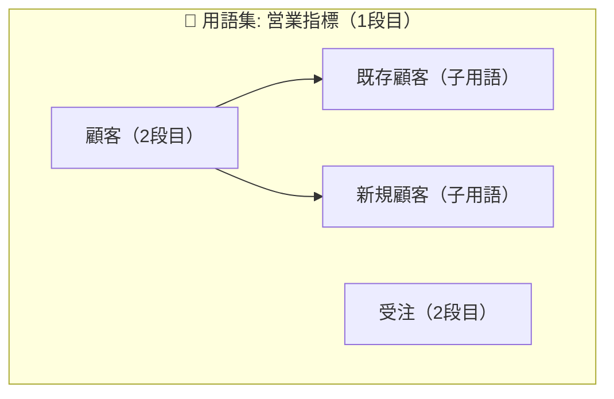

## はじめに

SageMaker Unified Studio（DataZone V2）でアセットを作成し、データカタログを整備しはじめると、出てくるのが「**グロサリー（ビジネス用語集）**」という言葉です。

グロサリー(ビジネス用語集)とは、アセットに付与可能なビジネスメタデータの一種です。  
本記事では、「グロサリーとは何か」を具体例を交えて整理します。扱うトピックは次のとおりです。

- グロサリー（ビジネス用語集）とは何か・何を管理するものなのか
- 用語集をどう定義していくか（定義方針の一例）
- グロサリー・用語に付けられる情報
- 個人情報区分のラベルを用語として定義する例

「そもそもアセットとは？」という方は、先に以下の記事を確認いただくと、よりイメージしやすいと思います。

- <!--ref:asset-from-glue-->[SageMaker Unified Studio 「アセットってなに？」](https://qiita.com/swkky/items/092df5056ee13b7a9297)<!--/ref-->

## グロサリー（ビジネス用語集）とは何か

グロサリーは、公式ドキュメント（[Create a business glossary](https://docs.aws.amazon.com/sagemaker-unified-studio/latest/userguide/create-maintain-business-glossary.html)）では次のように説明されています。

> a business glossary is a collection of business terms (words) that may be associated with assets (data). It provides appropriate vocabularies with a list of business terms and their definitions ... to make sure the same definitions are used across the organization when analyzing data.

一言で言うと、業務で使う用語とその定義を集めた「辞書」です。SageMaker Unified Studio では、この用語をアセット（テーブル）やカラムに紐付けられます。

グロサリーの具体例を挙げると、例えば、以下のように「財務指標」という 1 つの用語集の中に、複数の用語が紐づいているイメージです。

```
用語集: 財務指標
├─ ARR（年間経常収益） … 月次経常収益(MRR) × 12。解約・ダウングレードは減算
├─ 解約率（チャーンレート） … 期初契約数に対する期中解約数の割合
└─ LTV（顧客生涯価値） … 1顧客が契約期間全体でもたらす収益の見込み
```

### なぜグロサリーが必要なのか

具体例で考えてみます。例えば、「顧客数」という同じ名前の指標を、2つの業務領域がそれぞれ異なる意味で使用していたとします。

- 営業領域の「顧客」＝「契約を締結した企業（法人単位）」
- サポート領域の「顧客」＝「問い合わせをしてきた利用者（個人・担当者単位）」

上記のように同じ「顧客数」でも営業とサポートでは数がまるで違いますが、グロサリーでは、こうした**言葉の意味を定義して、アセットに適切な用語を付与する**ことで、「このデータはどちらの意味の顧客を指すのか」を明示でき、認識の齟齬を未然に防げます。

### Data Agent の活用の観点

グロサリーが効いてくるのは、人の認識合わせだけではありません。**SageMaker Data Agent**（自然言語でデータを探索し、SQL や Python スクリプトを生成できる機能）の精度に直結します。

公式ドキュメント（[Using Business Context with the SageMaker Data Agent](https://docs.aws.amazon.com/sagemaker-unified-studio/latest/userguide/data-agent-business-catalog.html)）によると、Data Agent はカタログのビジネスコンテキストを活用して、**技術的なテーブル名ではなくビジネス用語で**適切なテーブルを見つけます。

> the Data Agent uses **glossary terms**, custom metadata forms, summaries, and README content to find the correct tables for your queries

前述のように「営業の顧客」「サポートの顧客」のように別々の用語を定義して、アセットに正しい用語を付与しておけば、プロンプトで「顧客数」とだけ記述した場合でも、前後の文脈に応じて適切なテーブルを選び、生成する SQL やスクリプトの精度が上がることが期待出来ます。

## グロサリーの整備方針の一例

公式ドキュメントによると、グロサリーは次のような構造になっています。

> A business glossary can be a **flat list of terms** where **any term in the business glossary can be associated with a sublist of other terms**.

- **1段目: グロサリー（用語集）** … 用語をまとめる器。例:「財務指標」「営業指標」
- **2段目: グロサリー用語（term）** … 器の中の個々の用語（さらに用語配下に子用語のサブリストも持てる）



先ほどの「顧客」の齟齬は、**業務領域ごとにグロサリー（用語集）を分け**、それぞれの中に「顧客」を定義することで解消できます。言葉は同じでも、所属するグロサリーが違うので別物として区別できます。

```
グロサリー: 営業指標          ← 1段目（営業領域の用語集）
└─ 顧客 … 契約を締結した企業（法人単位）

グロサリー: サポート指標       ← 1段目（サポート領域の用語集）
└─ 顧客 … 問い合わせをしてきた利用者（個人・担当者単位）
```

こうすると、アセットには「営業指標の顧客」「サポート指標の顧客」と、**用語集ごと**に定義できます。

:::note info
「部署・チーム・事業ドメインごとに分ける」のは**あくまで分け方の一例**です。全社共通の1つのグロサリーに集約する、指標のカテゴリ単位で分ける、など運用方針は組織によってさまざまです。「グロサリーは名前空間（コンテキスト）として使える」という性質を理解したうえで、自組織に合った粒度を選んでください。
:::

## グロサリーの管理について

グロサリーは Unified Studio の**プロジェクト**に対して作成する要素です。公式ドキュメント（[Data governance and metadata](https://docs.aws.amazon.com/sagemaker-unified-studio/latest/userguide/data-governance.html)）によると、次の性質があります。

> Glossaries ... are owned by the project that creates them. Only members of the owning project can edit or delete a glossary ... However, glossaries, their terms ... are visible to all users in the domain.

- **作成・編集・削除は所有プロジェクトのメンバーだけ**
- **参照とアセットへの付与はドメイン内の全ユーザーが可能**

これにより「各プロジェクトで用語を定義・管理し、ドメイン全体（プロジェクト間）を横断して参照・使用する」という運用ができます。

各プロジェクトは**自分が定義した用語を自分で管理**しつつ、**他プロジェクトが定義したもの**もドメイン内なら自由に参照・アセットへ付与できます。  
ユースケースに応じて「データ基盤の開発チームが用語を集中管理する」形にも、「各チームがプロジェクトごとに分担して定義する」形にも対応できるため、柔軟な運用が可能です。

## グロサリーと用語に付けられる情報

用語だけでなく、1 段目のグロサリー（用語集）自体にも Description を付けられます。

**グロサリー（用語集）に付けられる情報**

| 項目 | 内容 | 例 |
|---|---|---|
| 名前 | 用語集の名前 | 営業指標 |
| 説明（Description） | この用語集が何をまとめたものか（最大4096文字） | 営業部門が売上・契約の集計で用いる指標の定義集 |
| 有効/無効（status） | 使えるかどうか。無効にすると**配下の用語もまとめて無効**になる | ENABLED |
| README | 補足情報（運用ルール、更新方針など）を別途記載 | この用語集の更新は毎月レビュー会で決定… |

**グロサリー用語（term）に付けられる情報**

| 項目 | 内容 | 例 |
|---|---|---|
| 名前 | 用語そのもの | `ARR`（年間経常収益） |
| 短い説明（short description） | 一覧で見える簡潔な定義（最大1024文字） | 年間換算した経常収益 |
| 長い説明（long description） | 詳細な定義・算出方法・判定基準（最大4096文字） | 月次経常収益(MRR) × 12。解約・ダウングレードは減算する… |
| 有効/無効（status） | 使えるかどうかの状態 | ENABLED |
| 用語間の関連（term relations） | 他の用語との親子関係（`isA` / `classifies`、各最大10件） | 「既存顧客」is a type of「顧客」 |
| README | 補足情報をリッチに記載 | 集計 SQL の例、注意点など |

## 活用例: 個人情報区分のラベルを用語として定義する

グロサリーはビジネス指標だけでなく、**データガバナンス用のラベル**の定義にも使えます。
具体的には、「カラムやテーブルに個人情報区分のラベルを付けたい」というニーズです。これは、区分そのものをグロサリー用語として定義するときれいに扱えます。  
別の記事で言及する予定ですが、アセットに付与出来るメタデータフォームの 1 フィールドとしてグロサリーの用語集を指定し、当該フィールドへの入力をパブリッシュ時の必須要件にして、値に応じてサブスクリプション時に承認が必要かどうか分けたりも出来ます。

```
グロサリー: 個人情報区分
├─ 個人情報なし        … 個人を特定できる情報を一切含まない
├─ 個人情報あり(匿名化) … 会員ID等の間接識別子のみで個人に紐づく
├─ 個人情報あり(要注意) … 氏名・電話・住所・メール等の直接識別子を含む
└─ 不明               … 有無が判断出来ないため、追加調査が必要
```

## まとめ

SageMaker Unified Studio のグロサリー（ビジネス用語集）を、データガバナンスの観点で整理しました。

- **グロサリーは「業務用語とその定義を集めた辞書」**。用語をアセット・カラムに付与して、全社で語彙をそろえる。
- グロサリーは **2段階層（用語集 → 用語、さらに用語配下に子用語）**。
- 用語集をどう分けるかは運用方針次第。**業務領域ごとに分ける**と「営業指標の顧客」「サポート指標の顧客」のように定義を区別できる（あくまで一例）。
- グロサリーは**プロジェクトが所有**し、**作成・編集は所有プロジェクトのみ／参照・付与はドメイン内全員**。各プロジェクトが定義・管理しつつ、ドメイン横断で使える。
- **個人情報区分などのガバナンス用ラベルもグロサリー用語として定義**すると、表記ゆれ防止・検索フィルタ・Data Agent 活用に効く。

## 参考

- [Data governance and metadata（SageMaker Unified Studio User Guide）](https://docs.aws.amazon.com/sagemaker-unified-studio/latest/userguide/data-governance.html)
- [Create a business glossary in Amazon SageMaker Unified Studio](https://docs.aws.amazon.com/sagemaker-unified-studio/latest/userguide/create-maintain-business-glossary.html)
- [Create a term in a glossary in Amazon SageMaker Unified Studio](https://docs.aws.amazon.com/sagemaker-unified-studio/latest/userguide/create-maintain-term.html)
- [Restricted asset classification in Amazon SageMaker Unified Studio](https://docs.aws.amazon.com/sagemaker-unified-studio/latest/userguide/restricted-asset-classification.html)
