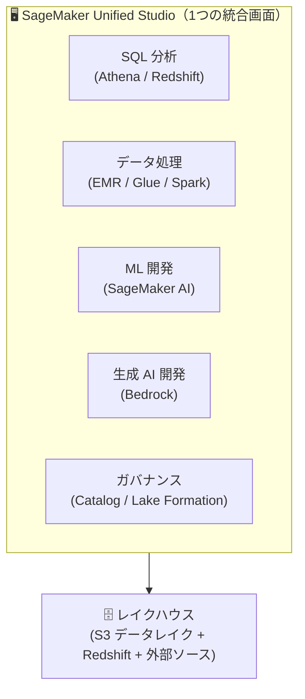
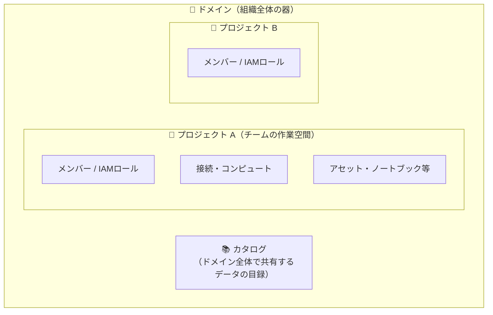
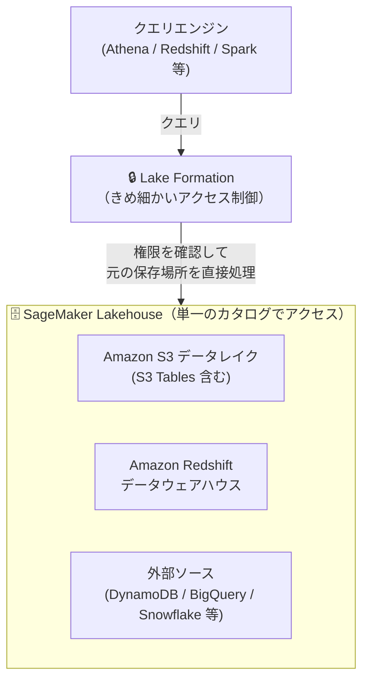
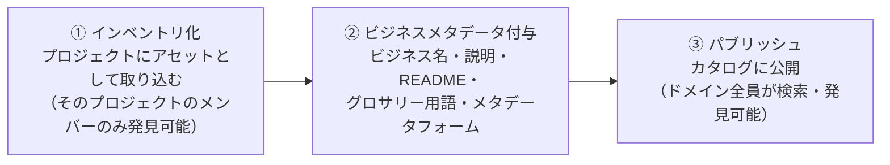
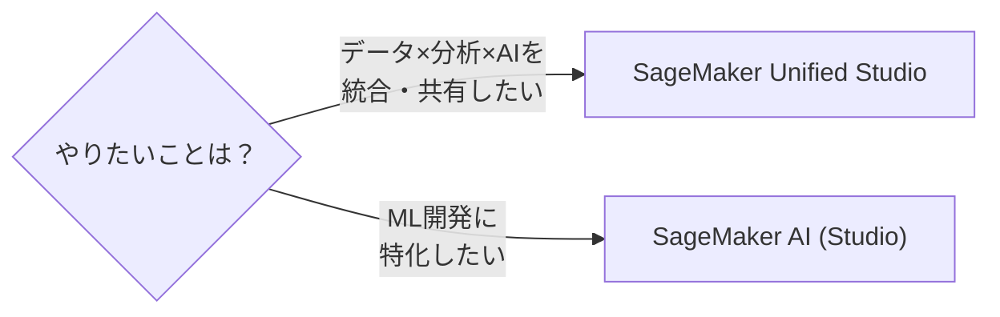

## はじめに

本記事は、Amazon SageMaker Unified Studio（以下 Unified Studio）を**これから触り始める人**に向けた入門記事です。「名前は聞くけれど、そもそも何をするサービスなのか」「従来の SageMaker（Studio）や DataZone、Glue、Athena と何が違うのか」といった、一番最初の疑問を整理することを目的にしています。

「AWS の分析系サービスが多すぎて、どこから触ればいいか分からない」「Unified Studio は結局どのサービスの寄せ集めなの？」といった方が、全体像を掴んでから個別の機能記事に進めるようにまとめました。

### まず3行で

- Unified Studio は、**AWS のデータ・分析・AI/ML・生成 AI の開発を「1つの画面」に統合した開発環境（IDE）**
- Athena / EMR / Glue / Redshift / MWAA / Bedrock / SageMaker AI などのツールを**横断して使え、データ・成果物をチームで安全に共有**できる
- re:Invent 2024 でプレビュー公開、**2025年3月に一般提供（GA）** 開始

### 想定読者

Unified Studio は、次のような「データに関わる人たち」が**同じ1つの環境で協働する**ことを狙ったサービスです。自分がどれかに当てはまるなら、本記事の対象読者です。

- データエンジニア（データの収集・加工・パイプライン構築）
- データサイエンティスト / ML 開発者（モデルの開発・学習・デプロイ）
- データアナリスト（SQL・BI による分析）
- 生成 AI アプリ開発者

### この記事で解説すること

- Unified Studio とは何か（一言でいうと何のためのサービスか）
- なぜ生まれたのか（従来の課題）
- Unified Studio を構成する主要な要素（ドメイン・プロジェクト・カタログ）
- 主な機能（SQL 分析・データ処理・データ統合・ML・生成 AI・ガバナンス・Amazon Q Developer）
- 従来の SageMaker Studio（SageMaker AI）との使い分け

### 前提知識

- AWS の基本的な概念（IAM、S3 など）
- Glue / Athena / Redshift といった分析系サービスの名前を聞いたことがある程度でOK

:::note
本記事は公式ドキュメントおよび AWS 公式ブログの内容をベースに整理していますが、UI の細部やサービス仕様は変わる可能性があります。設計・使い分けの方針部分には筆者の見解を含みます。
:::

## SageMaker Unified Studio とは？

一言でいうと、Unified Studio は **AWS のデータ・分析・AI/ML・生成 AI を「1つの画面」で扱えるようにした統合開発環境**です。

公式ドキュメントでは次のように説明されています。

> As a part of the next generation of Amazon SageMaker, the Amazon SageMaker Unified Studio is a unified development experience that brings together AWS data, analytics, artificial intelligence (AI), and machine learning (ML) services.
>
> — [What is Amazon SageMaker Unified Studio?](https://docs.aws.amazon.com/sagemaker-unified-studio/latest/userguide/what-is-sagemaker-unified-studio.html)

これまで AWS でデータ分析・AI 開発をやろうとすると、用途ごとに別々のサービス・別々のコンソールを行き来する必要がありました。

| やりたいこと | 従来使っていたサービス |
|------|------|
| SQL でデータを分析 | Amazon Athena / Amazon Redshift |
| 大規模データ処理（Spark 等） | Amazon EMR / AWS Glue |
| ワークフローのオーケストレーション | Amazon MWAA（Managed Airflow） |
| ML モデルの開発・学習・デプロイ | Amazon SageMaker AI（旧 SageMaker） |
| 生成 AI アプリ開発 | Amazon Bedrock |
| データカタログ・ガバナンス | Amazon DataZone / AWS Glue Data Catalog / Lake Formation |

Unified Studio は、これらの機能を**1つの Web 画面（統合スタジオ）に集約**したものです。つまり「新しく登場した単機能のサービス」というより、**既存のAWS 分析・AI サービス群をまとめる “ハブ” のような位置づけ**だとイメージすると分かりやすいです。

AWS 公式ブログでも、プレビュー発表時に次のように説明されています。

> SageMaker Unified Studio (preview) is a single data and AI development environment. It brings together functionality and tools from the range of standalone “studios,” query editors, and visual tools that we have today in Amazon Athena, Amazon EMR, AWS Glue, Amazon Redshift, Amazon Managed Workflows for Apache Airflow (Amazon MWAA), and the existing SageMaker Studio.
>
> — [Collaborate and build faster with Amazon SageMaker Unified Studio, now generally available](https://aws.amazon.com/blogs/aws/collaborate-and-build-faster-with-amazon-sagemaker-unified-studio-now-generally-available/)

つまり、これまで各サービスに分かれていた**スタジオ・クエリエディタ・ビジュアルツール**を1か所に束ねたのが Unified Studio です。

## なぜ生まれたのか？（従来の課題）

Unified Studio が登場した背景には、「分析ワークフローと AI ワークフローが融合してきた」という流れがあります。

> Analytics and AI workflows are converging, with organizations now using the same data sources for traditional analytics, machine learning, and generative AI.
>
> — [What is Amazon SageMaker?](https://docs.aws.amazon.com/next-generation-sagemaker/latest/userguide/what-is-sagemaker.html)

同じデータを、BI 分析にも、機械学習にも、生成 AI にも使うようになった結果、従来のように「サービスごとにコンソールを分ける」やり方では課題が目立つようになりました。AWS 公式ブログでは、具体的に次の3つの課題が挙げられています。

| # | 従来の課題 | Unified Studio での解決アプローチ |
|---|------|------|
| 1 | サービスごとに開発体験（UI・操作）がバラバラで、**それぞれ学習するのに時間がかかる** | ツールを一度覚えれば全サービスで使える統合体験 |
| 2 | データ・コード・ML モデルなどの成果物が**別々のサービスに散在し、相互の関係が把握しづらい** | データ・コード・成果物・コンピュートをプロジェクト単位で一元的に可視化 |
| 3 | 各サービスにまたがるデータ・成果物への**アクセス制御／ガバナンスが手作業**になりがち | プロジェクトに追加すると必要な権限を自動構成。カタログでガバナンスを一元化 |

> First, it can be time consuming for users to learn multiple services’ development experiences. Second, because data, code, and other development artifacts like machine learning (ML) models are stored within different services, it can be cumbersome for users to understand how they interact with each other and make changes. Third, configuring and governing access to appropriate users ... is a manual process.
>
> — [An integrated experience for all your data and AI with Amazon SageMaker Unified Studio](https://aws.amazon.com/blogs/big-data/an-integrated-experience-for-all-your-data-and-ai-with-amazon-sagemaker-unified-studio/)

こうした課題に対し、これまで多くの組織はサービス間の独自連携やアクセス管理の仕組みを自前で作り込んでいました。Unified Studio はそれを標準機能として肩代わりする、という発想のサービスです。

「次世代の SageMaker」は、大きく **① Unified Studio（統合開発環境）** と **② データ&AI ガバナンス** の2つの柱で構成されており、その土台に **オープンなレイクハウスアーキテクチャ（Apache Iceberg 互換）** がある、という構造になっています。

## Unified Studio を構成する主要な要素

Unified Studio を理解するうえで、まず押さえておきたいのが **ドメイン / プロジェクト / カタログ** という3つの単位です。これは Unified Studio の基盤になっている **Amazon DataZone** の概念でもあります。

| 要素 | 役割 | ざっくり言うと |
|------|------|------|
| **ドメイン** | 組織全体のデータ・AI ガバナンスの最上位単位。管理者がユーザー／グループのアクセスを管理する | 会社・組織全体の「入れ物」 |
| **プロジェクト** | ドメイン内のチーム単位の作業空間。メンバー、IAM ロール、接続情報、コンピュートが紐づく | チーム／目的ごとの「作業部屋」 |
| **カタログ** | ドメイン全体で共有されるデータの目録。プロジェクトがアセットをパブリッシュすると、他プロジェクトから検索・発見できる | 全社共通の「データの目録」 |

利用者の基本的な流れは次の通りです。

1. 管理者がドメインを作成し、SSO / IAM でユーザーを招待する
2. ユーザーはドメイン URL にアクセスし、プロジェクトを作成 or 参加する（作成時に用途に応じた **プロジェクトプロファイル** を選ぶ。例: 「Data analytics and AI-ML model development」）
3. プロジェクト内のツール（ノートブック、SQL エディタ等）を使ってデータを分析・共有する

:::note info
「ドメイン」「プロジェクト」「アセット」「パブリッシュ／サブスクリプション」といった概念は、Glue テーブルをカタログに登録する記事でより具体的に解説しています。あわせて読むと理解が深まります。
👉 [【SageMaker Unified Studio 入門】「アセットってなに？」を理解して、AWS CLI から作成してみる](https://qiita.com/swkky/items/092df5056ee13b7a9297)
:::

### ホーム画面のイメージ

Unified Studio のホーム画面は、大きく「探す（Discover）」と「作る（Build with projects）」に分かれています。全体像を掴む参考になります。

| 区分 | メニュー | できること |
|------|------|------|
| **Discover（探す）** | データカタログ | データアセットの検索・クエリ、ML モデルの探索 |
| | 生成 AI プレイグラウンド | チャット／画像プレイグラウンドで FM を試す |
| | 共有された生成 AI アセット | 共有された生成 AI アプリ・プロンプトの閲覧 |
| **Build with projects（作る）** | ML・生成 AI モデル | マネージドな基盤でモデルの構築・学習・デプロイ |
| | 生成 AI アプリ開発 | Bedrock IDE で FM・プロンプト・エージェント・ガードレールを扱う |
| | データ処理・SQL 分析 | Athena / EMR / Glue / Redshift でデータを分析・加工 |
| | データ&AI ガバナンス | データプロダクトをカタログに公開し、アクセスを統制 |

## 主な機能

Unified Studio が「1つの画面」でカバーする代表的な機能を整理します。

### 1. SQL 分析

Athena / Redshift のクエリエンジンを選んで、レイクハウス上のデータに対して SQL を実行できます。S3 上のオープンフォーマット（Iceberg 等）のデータを、データを移動・複製することなく高性能にクエリできるのが特徴です。

組み込みの **SQL エディタ**では、テーブル・カラム・関数のリアルタイム補完が効くほか、結果をその場で表・グラフ（円グラフ等）に可視化できます。後述の Amazon Q Developer による自然言語からの SQL 生成にも対応しています。

### 2. データ処理

Apache Spark / Trino などのオープンソースの分析フレームワークを、統合環境の中で実行できます。裏側では Amazon EMR、AWS Glue、Amazon Athena が使われます。

特徴的なのが **マルチコンピュートノートブック**です。1つの JupyterLab ノートブックの中で、セルごとに接続タイプ（Local Python / PySpark / SQL 等）とコンピュート（Glue / EMR / Athena / Redshift 等）を切り替えられます。「このセルは Glue for Spark で前処理し、次のセルは Athena で SQL 集計」といった使い方が、環境を分けずに1つのノートブックで完結します。

### 3. データ統合

S3 データレイクと Redshift データウェアハウスを横断してアクセスできるほか、以下のような形で多様なデータソースを統合できます。

| 統合方法 | 内容 |
|------|------|
| zero-ETL 連携 | 運用 DB や Salesforce / SAP などのデータをほぼリアルタイムでレイクハウスに取り込む |
| 数百のコネクタ | 各種データソースからのデータ統合 |
| フェデレーテッドクエリ | DynamoDB / Google BigQuery / Snowflake などのデータをその場でクエリ |

### 4. 機械学習・モデル開発

従来の Amazon SageMaker（現 **SageMaker AI**）のほとんどの機能を Unified Studio 内から利用できます。ノートブック、パイプライン、MLOps などを使って、モデルの構築・学習・デプロイまでを行えます。

### 5. 生成 AI アプリケーション開発

Amazon Bedrock の機能に Unified Studio からアクセスでき、Anthropic・Meta・Amazon などの基盤モデル（FM）や Knowledge Bases 等を使って、生成 AI アプリを素早く構築・カスタマイズできます。

### 6. データ&AI ガバナンス

**Amazon SageMaker Catalog** により、承認されたデータ・アセットを（生成 AI が生成したメタデータを使った）セマンティック検索で安全に発見できます。また以下のようなガバナンス機能が標準で組み込まれています。

- パブリッシュ／サブスクリプションによる安全なデータ共有
- データ品質モニタリング、機微データ検出
- データ・ML のリネージ（系譜）追跡
- Amazon Bedrock Guardrails によるモデル出力の保護

### 7. Amazon Q Developer による生成 AI アシスト

GA と同時に、生成 AI アシスタント **Amazon Q Developer** が Unified Studio に統合されました。データ・AI 開発のライフサイクル全体を、自然言語で支援してくれます。無料枠が既定で使えるため、追加設定なしで利用開始できます。

| 使いどころ | 例 |
|------|------|
| **オンボーディング補助** | 「ドメインとプロジェクトの違いは？」など、初学者の疑問に回答 |
| **データ発見（Catalog 連携）** | 「決済に関するデータセットを全部見せて」と自然言語で SageMaker Catalog を検索 |
| **SQL 生成** | 「年代・地域別に決済手段の傾向を分析して」→ 適切な JOIN を含む SQL を生成 |
| **コード補助・ETL** | ノートブックでのリアルタイムなコード提案、ETL ジョブ構築の支援、トラブルシュート |

「メタデータ構造を意識せず、自然言語でデータを探して SQL まで書ける」点が、従来の分析ツールとの大きな違いです。

なお、上記の中でも特に重要な土台となるのが **SageMaker Lakehouse（データの置き場・アクセスの仕組み）** と **SageMaker Catalog（データの目録・ガバナンスの仕組み）** です。この2つは Unified Studio を理解するうえで欠かせないので、章を分けて解説します。

## SageMaker Lakehouse とは？

SageMaker Lakehouse は、Unified Studio の**データの土台**となるアーキテクチャです。一言でいうと、**S3 データレイクと Redshift データウェアハウスを1つに束ね、データを移動・コピーせずに横断アクセスできるようにする仕組み**です。

> The lakehouse architecture of Amazon SageMaker unifies data across Amazon S3 data lakes and Amazon Redshift data warehouses so you can work with your data in one place.
>
> — [What is the lakehouse architecture of Amazon SageMaker?](https://docs.aws.amazon.com/sagemaker-lakehouse-architecture/latest/userguide/what-is-smlh.html)

### そもそも「レイクハウス」とは

レイクハウス（Lakehouse）は、**データレイクの拡張性・低コスト**と、**データウェアハウスの性能・信頼性**を1つにしたアーキテクチャです。「大量の多様なデータを安く貯める（レイク）」か「高速に分析する（ウェアハウス）」かの二者択一を解消することを狙っています。

### 特徴

| 特徴 | 内容 |
|------|------|
| **Apache Iceberg 互換** | オープンテーブル形式 Iceberg に準拠。Glue Data Catalog の Iceberg REST API を通じて、AWS・非 AWS 問わず Iceberg 対応エンジンからアクセスできる |
| **単一カタログ** | S3・Redshift・外部ソースを1つのカタログから発見・クエリできる |
| **データを動かさない** | クエリ実行時、エンジンは元の保存場所（S3 / Redshift）のデータを直接処理する。移動・複製が不要 |
| **zero-ETL / フェデレーテッドクエリ** | 運用 DB や SaaS のデータをほぼリアルタイムに取り込む、あるいはその場でクエリできる |
| **きめ細かいアクセス制御** | Lake Formation の権限が、すべての分析・ML ツール／エンジンにまたがって適用される |

:::note info
smus-01 の記事で「Glue テーブルを Lake Formation の権限管理下に置く」手順が出てきますが、これはまさにこの Lakehouse アーキテクチャの**アクセス制御（Lake Formation）**の部分に該当します。
:::

## SageMaker Catalog とは？

SageMaker Catalog は、Unified Studio の**データの目録（カタログ）とガバナンス**を担う機能です。組織全体のデータに**ビジネスコンテキスト（意味・文脈）を付けて整理し、誰もが素早く見つけて理解できる**ようにします。

> You can use the Amazon SageMaker Catalog to catalog data across your organization with business context and thus enable everyone in your organization to find and understand data quickly.
>
> — [Catalog in IDC-based domains](https://docs.aws.amazon.com/sagemaker-unified-studio/latest/userguide/working-with-business-catalog.html)

### データが公開されるまでの流れ

Catalog では、データがいきなり全員に見えるわけではありません。次の3ステップを経て、ドメイン全体から発見できるようになります。

| ステップ | 内容 |
|------|------|
| **① インベントリ化** | データをプロジェクトのアセットとして取り込む。この時点ではそのプロジェクトのメンバーにしか見えない |
| **② ビジネスメタデータ付与** | データオーナーがビジネス名・説明・README・グロサリー用語・メタデータフォームを付与する |
| **③ パブリッシュ** | カタログに公開すると、ドメインの全ユーザーが検索・発見できるようになる（最新バージョンのみが公開対象） |

### なぜ Catalog が重要か

| 観点 | 内容 |
|------|------|
| **データディスカバリー** | 生成 AI が作成したメタデータを使った**セマンティック検索**で、承認済みのデータ・AI アセットを安全に発見できる |
| **ガバナンス** | パブリッシュ／サブスクリプションのワークフローで、データオーナーが承認をコントロールしながら安全に共有できる |
| **AI Ready** | 付与したビジネスメタデータは SageMaker Data Agent（自然言語でのデータ探索・コード生成）でも活用される |

:::note
「アセット」「ビジネスメタデータ」「パブリッシュ／サブスクリプション」の具体的な作り方・付け方は、以下の記事で詳しく解説しています。
👉 [【SageMaker Unified Studio 入門】「アセットってなに？」を理解して、AWS CLI から作成してみる](https://qiita.com/swkky/items/092df5056ee13b7a9297)
:::

### Lakehouse と Catalog の関係

紛らわしいので整理すると、両者の役割は次のように分かれます。

| | SageMaker Lakehouse | SageMaker Catalog |
|------|------|------|
| **役割** | データの**置き場所とアクセスの仕組み**（物理層に近い） | データの**目録とガバナンス**（ビジネス・意味の層） |
| **扱うもの** | S3 / Redshift / 外部ソースの実データ | アセット（メタデータ）とビジネスコンテキスト |
| **たとえるなら** | データの「倉庫と搬入・搬出の仕組み」 | 倉庫の中身を説明した「カタログ・在庫台帳」 |

「Lakehouse がデータを1か所に集約・アクセス可能にし、Catalog がそれに意味付けして安全に共有できるようにする」という補完関係だと捉えると分かりやすいです。

## SageMaker AI（旧 SageMaker Studio）との使い分け

「元の SageMaker はどうなったの？」という疑問がよく出ます。結論としては、**従来の Amazon SageMaker は「SageMaker AI」に改名**され、次世代 SageMaker の中の1機能（ML 開発部分）として残っています。

公式の使い分けの指針は次の通りです。

| こういう場合 | 選ぶもの |
|------|------|
| 分析・ML・生成 AI を横断してデータを統合・共有したい | **SageMaker Unified Studio** |
| ML 開発の専用ツールだけに集中したい | **SageMaker AI（Studio）** |
| RStudio / Canvas / 共有スペースでのリアルタイム協業 / Feature Store が必要 | **SageMaker AI（Studio）** |

つまり、**「データを横断的に扱い、チームで共有・ガバナンスしながら分析〜AI 開発まで回したい」なら Unified Studio**、**「純粋に ML モデルの開発に集中したい」なら SageMaker AI** という整理になります。

## まとめ

- SageMaker Unified Studio は、AWS のデータ・分析・AI/ML・生成 AI を **1つの画面に統合した開発環境**
- 新しい単機能サービスではなく、Athena / Glue / EMR / Redshift / Bedrock / SageMaker AI などを**束ねるハブ**という位置づけ
- 土台には **SageMaker Lakehouse（S3 + Redshift + 外部ソース、Iceberg 互換）** があり、データを動かさずに横断アクセスできる
- **SageMaker Catalog** がデータにビジネスコンテキストを付けて整理し、パブリッシュ／サブスクリプションで安全に共有・ガバナンスする
- **ドメイン / プロジェクト / カタログ** という単位でチームごとの作業空間とデータ共有を実現する
- **Amazon Q Developer** により、自然言語でのデータ発見・SQL 生成・コード補助が全体を通して使える
- ML 開発に特化したい場合は従来の **SageMaker AI（Studio）** を選ぶ

## 次の記事

サービスの全体像を掴んだら、次は「カタログにデータを登録する」ところから始めるのがおすすめです。Glue テーブルをアセットとして登録する具体的な手順を解説しています。

👉 [【SageMaker Unified Studio 入門】「アセットってなに？」を理解して、AWS CLI から作成してみる](https://qiita.com/swkky/items/092df5056ee13b7a9297)

## 参考

### 公式ドキュメント

- [What is Amazon SageMaker Unified Studio?](https://docs.aws.amazon.com/sagemaker-unified-studio/latest/userguide/what-is-sagemaker-unified-studio.html)
- [What is Amazon SageMaker?（次世代 SageMaker の概要）](https://docs.aws.amazon.com/next-generation-sagemaker/latest/userguide/what-is-sagemaker.html)
- [Amazon SageMaker Catalog（ビジネスカタログ）](https://docs.aws.amazon.com/sagemaker-unified-studio/latest/userguide/working-with-business-catalog.html)
- [Open lakehouse architecture](https://docs.aws.amazon.com/sagemaker-unified-studio/latest/userguide/lakehouse.html)
- [What is the lakehouse architecture of Amazon SageMaker?](https://docs.aws.amazon.com/sagemaker-lakehouse-architecture/latest/userguide/what-is-smlh.html)

### AWS 公式ブログ

- [Introducing the next generation of Amazon SageMaker: The center for all your data, analytics, and AI（re:Invent 2024 プレビュー発表）](https://aws.amazon.com/blogs/aws/introducing-the-next-generation-of-amazon-sagemaker-the-center-for-all-your-data-analytics-and-ai/)
- [Collaborate and build faster with Amazon SageMaker Unified Studio, now generally available（GA 発表）](https://aws.amazon.com/blogs/aws/collaborate-and-build-faster-with-amazon-sagemaker-unified-studio-now-generally-available/)
- [An integrated experience for all your data and AI with Amazon SageMaker Unified Studio（統合体験の解説）](https://aws.amazon.com/blogs/big-data/an-integrated-experience-for-all-your-data-and-ai-with-amazon-sagemaker-unified-studio/)
- [Accelerate analytics and AI innovation with the next generation of Amazon SageMaker](https://aws.amazon.com/blogs/big-data/accelerate-analytics-and-ai-innovation-with-the-next-generation-of-amazon-sagemaker/)
