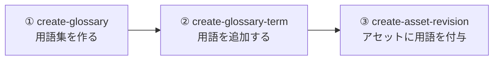

## はじめに

本記事では、AWS CLI でグロサリーと用語を作成し、アセットに付与するまでの手順を扱います。
アセット、グロサリーについては、それぞれ以下の記事でまとめています。

- [アセット](https://qiita.com/swkky/items/092df5056ee13b7a9297)
- [グロサリー](https://qiita.com/swkky/items/8259ea1f71ab6c8d6be5)

## 前提

- AWS CLI v2 がインストール・設定済みであること
- 対象の SageMaker Unified Studio（DataZone）ドメインが作成済みであること
- グロサリーを所有させるプロジェクトが作成済みであること
- 実行するプリンシパルに `datazone:CreateGlossary` / `datazone:CreateGlossaryTerm` などの権限があること

本記事では以下のサンプル値を使います。

| 項目 | 値 |
|---|---|
| ドメインID | `dzd-xxxxxxxxxxxxx` |
| 所有プロジェクトID | `xxxxxxxxxxxxxx` |
| リージョン | `ap-northeast-1` |

## 作成の全体像

作成の流れは **① グロサリー（用語集）を作る → ② その中に用語を追加する → ③ アセットに用語を付与する** の3ステップです。



グロサリーIDや用語IDは後続ステップの入力になるため、各コマンドのレスポンスに含まれる `id` を控えながら進めます。

## ① グロサリー（用語集）を作成する

`create-glossary` で用語集を作ります。

```bash
aws datazone create-glossary \
  --region ap-northeast-1 \
  --domain-identifier dzd-xxxxxxxxxxxxx \
  --owning-project-identifier xxxxxxxxxxxxxx \
  --name "営業指標" \
  --description "営業部門が売上・契約の集計で用いる指標の定義集。更新は月次レビューで決定する。" \
  --status ENABLED
```

| オプション | 必須 | 説明 |
|---|---|---|
| `--domain-identifier` | ○ | ドメインID（`dzd-` で始まる） |
| `--owning-project-identifier` | ○ | 所有プロジェクトID（このプロジェクトのメンバーだけが編集可） |
| `--name` | ○ | 用語集の名前（最大256文字） |
| `--description` | | 用語集の説明（最大4096文字） |
| `--status` | | `ENABLED` / `DISABLED`（**省略時は無効**なので、使うなら明示的に `ENABLED`） |
| `--usage-restrictions` | | `ASSET_GOVERNED_TERMS` を指定すると**制限付きグロサリー**になる |

レスポンス例（抜粋）:

```json
{
  "domainId": "dzd-xxxxxxxxxxxxx",
  "id": "abcd1234efgh5678",
  "name": "営業指標",
  "owningProjectId": "xxxxxxxxxxxxxx",
  "status": "ENABLED"
}
```

この `id`（例: `abcd1234efgh5678`）が、次のステップで使う**グロサリーID**です。

:::note info
`--usage-restrictions ASSET_GOVERNED_TERMS` を付けると、付与できるユーザーを制限できる「制限付きグロサリー」になります。
:::

## ② グロサリー用語を追加する

`create-glossary-term` で、①で作ったグロサリーの中に用語を追加します。定義は **`--short-description`（短い説明）と `--long-description`（長い説明）** に分けて書けます。

```bash
aws datazone create-glossary-term \
  --region ap-northeast-1 \
  --domain-identifier dzd-xxxxxxxxxxxxx \
  --glossary-identifier abcd1234efgh5678 \
  --name "顧客" \
  --short-description "契約を締結した企業（法人単位）" \
  --long-description "1法人を1顧客と数える。同一法人内の複数担当者は1顧客に含める。解約済みは除外。" \
  --status ENABLED
```

| オプション | 必須 | 説明 |
|---|---|---|
| `--domain-identifier` | ○ | ドメインID |
| `--glossary-identifier` | ○ | ①で作ったグロサリーのID |
| `--name` | ○ | 用語名（最大256文字） |
| `--short-description` | | 短い説明（最大1024文字） |
| `--long-description` | | 長い説明（最大4096文字） |
| `--term-relations` | | 他の用語との関連（`isA` / `classifies`、各最大10件） |
| `--status` | | `ENABLED` / `DISABLED` |

レスポンスに含まれる `id` が**用語ID**です。アセットへ付与するときに使うので控えておきます。

### 用語間の親子関係を付ける

用語配下に子用語をぶら下げたい場合は `--term-relations` を使います。たとえば「既存顧客」を「顧客」の一種（`isA`）として関連付けます。

```bash
aws datazone create-glossary-term \
  --region ap-northeast-1 \
  --domain-identifier dzd-xxxxxxxxxxxxx \
  --glossary-identifier abcd1234efgh5678 \
  --name "既存顧客" \
  --short-description "過去に取引実績のある顧客" \
  --term-relations 'isA=<term-id-of-顧客>' \
  --status ENABLED
```

`<term-id-of-顧客>` は、先に作った「顧客」用語の ID に置き換えます。

- `isA` … この用語が、指定した用語の**一種**であることを示す（既存顧客 is a type of 顧客）
- `classifies` … この用語が、指定した用語を**分類・総称**することを示す（`isA` の逆向き）

## ③ アセットにグロサリー用語を付与する

作成した用語は、`create-asset-revision` の `--glossary-terms` でアセットに付与します（アセットは作成済みである前提です）。

```bash
aws datazone create-asset-revision \
  --region ap-northeast-1 \
  --domain-identifier dzd-xxxxxxxxxxxxx \
  --identifier <asset-id> \
  --name <asset-name> \
  --glossary-terms '["<term-id-of-顧客>", "<term-id-of-受注>"]'
```

- `--glossary-terms` には**用語ID**の配列を渡します（用語名ではありません）
- `create-asset-revision` はアセットの**新しいリビジョンを作成**します。付与したい用語IDは1回のリビジョンでまとめて指定します

## 作成後の確認・更新・削除

作成したグロサリー・用語は、以下のコマンドで確認や更新ができます。

| 操作 | コマンド |
|---|---|
| グロサリー一覧・検索 | `aws datazone search --search-scope GLOSSARY ...`（または UI の Catalog から確認） |
| グロサリー詳細取得 | `aws datazone get-glossary --domain-identifier ... --identifier <glossary-id>` |
| 用語詳細取得 | `aws datazone get-glossary-term --domain-identifier ... --identifier <term-id>` |
| グロサリー更新 | `aws datazone update-glossary ...` |
| 用語更新 | `aws datazone update-glossary-term ...` |
| グロサリー削除 | `aws datazone delete-glossary ...` |
| 用語削除 | `aws datazone delete-glossary-term ...` |

:::note info
グロサリーを `DISABLED` にすると、**配下の用語もまとめて無効**になります。一時的に使わせたくない場合は削除ではなく無効化が使えます。
:::

## まとめ

AWS CLI でグロサリー・用語を作成する手順を整理しました。

- **① `create-glossary`** で用語集を作る。`--description` に対象範囲を書き、`--status ENABLED` を明示するのがポイント。レスポンスの `id` がグロサリーID。
- **② `create-glossary-term`** で用語を追加する。定義は `--short-description` / `--long-description` に分けて書く。親子関係は `--term-relations`（`isA` / `classifies`）。多数登録はシェルループが便利。
- **③ `create-asset-revision --glossary-terms`** でアセットに用語ID配列を付与する。
- `create-glossary` / `create-glossary-term` は共有ドメインへの変更なので、命名・定義は事前レビュー推奨。

## 参考

- [create-glossary — AWS CLI Command Reference](https://docs.aws.amazon.com/cli/latest/reference/datazone/create-glossary.html)
- [create-glossary-term — AWS CLI Command Reference](https://docs.aws.amazon.com/cli/latest/reference/datazone/create-glossary-term.html)
- [create-asset-revision — AWS CLI Command Reference](https://docs.aws.amazon.com/cli/latest/reference/datazone/create-asset-revision.html)
- [Create a business glossary in Amazon SageMaker Unified Studio](https://docs.aws.amazon.com/sagemaker-unified-studio/latest/userguide/create-maintain-business-glossary.html)
- [Create a term in a glossary in Amazon SageMaker Unified Studio](https://docs.aws.amazon.com/sagemaker-unified-studio/latest/userguide/create-maintain-term.html)
