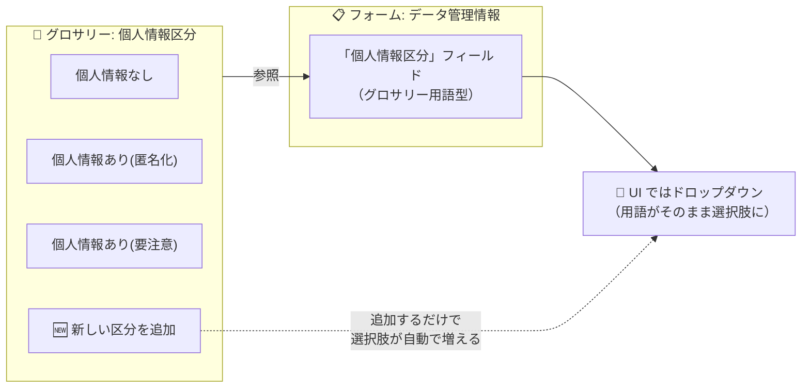

## はじめに

SageMaker Unified Studio（DataZone V2）でデータカタログを整備していくと、グロサリー（ビジネス用語集）と並んでよく出てくるのが「**メタデータフォーム**」です。

本記事では、データガバナンスの観点から、メタデータフォームとは何かを具体例を交えて整理します。扱うトピックは次のとおりです。

- メタデータフォームとは何か・何を管理するものなのか
- フィールドで使えるデータ型
- 活用例: データ管理フォーム
- フィールドで「グロサリー用語型」を選べること（統制語彙の作り方）

グロサリーの概念については、先に以下の記事を読むと理解が深まります（後半でグロサリーと連携するため）。

- [【データガバナンス入門】SageMaker Unified Studio のグロサリー（ビジネス用語集）を具体例で理解する](https://qiita.com/swkky/items/xxxxxxxxxxxx)（※公開後にリンク差し替え）
- <!--ref:asset-from-glue-->[SageMaker Unified Studio 「アセットってなに？」](https://qiita.com/swkky/items/092df5056ee13b7a9297)<!--/ref-->

:::note
本記事の仕様は公式ドキュメントに基づいていますが、UI の細部や仕様は変わる可能性があります。設計方針の部分には筆者の見解を含みます。
:::

## メタデータフォームとは何か

メタデータフォーム（metadata form）は、**アセットに付与する属性の入力フォーム（テンプレート）**です。公式ドキュメント（[Create a metadata form](https://docs.aws.amazon.com/sagemaker-unified-studio/latest/userguide/create-metadata-form.html)）では次のように説明されています。

> metadata forms are simple forms to augment additional business context to the asset metadata ... They serve as extensible mechanisms for data owners to enrich the asset ... Metadata forms can also serve a mechanism to enforce consistency to all assets being published.

Glue から取り込んだテーブルには、列名・型・S3 パスといった「技術メタデータ」しか付いていません。そこに「このデータのオーナーは誰か」「更新頻度は」「機密レベルは」といった**ビジネス上の属性を、決まった項目として埋めさせる**のがメタデータフォームです。

イメージとしては、アセットに貼り付ける「**カルテ**」や「**入力用紙**」です。1つのフォームは複数の**フィールド（項目）**で構成されます。

```
メタデータフォーム: データ管理情報
├─ ソースシステム   (string)   … 例: 基幹販売DB
├─ データオーナー   (string)   … 例: 営業企画部
├─ 更新頻度        (string)   … 例: 日次バッチ
└─ 保持年数        (integer)  … 例: 7
```

このフォームをアセットに貼り付けると、そのアセットに「ソースシステム＝基幹販売DB、データオーナー＝営業企画部…」という**構造化された属性**が付きます。

### グロサリーとの違い

グロサリーと役割が似ていて混同しやすいので、整理しておきます。

| | グロサリー | メタデータフォーム |
|---|---|---|
| ひとことで言うと | 用語の**辞書** | 属性の**入力用紙** |
| 管理するもの | 用語とその定義 | アセットごとの属性値 |
| 使い方 | アセット/カラムに用語を**紐付ける** | アセットに項目を**埋めさせる** |

ざっくり言うと、**グロサリーは「言葉の意味をそろえる」**もの、**メタデータフォームは「アセットごとに決まった項目を埋めさせる」**ものです。そして後述するように、**フォームのフィールド値としてグロサリー用語を使える**ので、この2つは連携します。

### 誰が管理し、誰が使えるのか

メタデータフォームもグロサリーと同じく、Unified Studio の**プロジェクト**に対して作成する要素です。

- **作成・編集・削除は所有プロジェクトのメンバーだけ**
- **参照とアセットへの付与はドメイン内の全ユーザーが可能**

これにより「あるプロジェクトで共通フォームを定義し、ドメイン全体で使い回す」という運用ができます。

## フィールドで使えるデータ型

メタデータフォームは1つ以上の**フィールド**で構成されます。各フィールドには型を指定でき、公式ドキュメントによると次の型が使えます。

> A metadata form definition is composed of one or more field definitions, with support for **boolean, date, decimal, integer, string, and business glossary field value** data types.

| 型 | 用途の例 |
|---|---|
| `string` | データオーナー名、備考 |
| `integer` / `decimal` | 保持年数、想定行数 |
| `boolean` | 外部提供の可否 |
| `date` | 提供開始日 |
| **business glossary（グロサリー用語型）** | 機密レベル、個人情報区分（選択式） |

各フィールドは**必須／任意**を設定できます。必須フィールドを持つフォームをアセットに紐付けると、値が埋まるまで公開できないようにでき、カタログ全体で属性の抜け漏れを防げます。

## 活用例: データ管理フォーム

たとえば「全アセットに必ず付ける管理情報」を、次のようなフォームにできます。

```
メタデータフォーム: データ管理情報
├─ ソースシステム    (string, 必須)          … 例: 基幹DB
├─ データオーナー    (string, 必須)          … 例: 営業企画部
├─ 更新頻度         (string)               … 例: 日次
├─ 保持年数         (integer)              … 例: 7
├─ 外部提供の可否    (boolean)              … 例: false
└─ 個人情報区分     (グロサリー用語型, 必須)  … 例: 個人情報あり(要注意)
```

このフォームを標準フォームとして運用し、公開時に必須項目を埋めさせることで、次のような効果が得られます。

- **属性の抜け漏れ防止**: オーナー不明・出所不明のアセットがカタログに増えない
- **検索性の向上**: 「営業企画部がオーナーのアセット」「日次更新のアセット」で絞り込める
- **ガバナンスの土台**: 最後の「個人情報区分」のように、機微度の記録に使える

## ハイライト: フィールドで「グロサリー用語型」を選べる

ここがメタデータフォームとグロサリーが連携する肝です。前述のとおり、フィールド型には **business glossary（グロサリー用語型）** があります。

これを使うと、そのフィールドは「**指定したグロサリーの用語から1つ選ぶ**」という選択式（ドロップダウン）になります。自由記述させたくない項目——たとえば「個人情報区分」や「機密レベル」——に最適です。

### なぜ「グロサリー用語型」が便利なのか

「個人情報区分」を自由記述の `string` にすると、入力者によって「あり」「有」「PII」「個人情報含む」などと表記がバラつき、後で集計もフィルタもできません。

そこで**グロサリー用語型**を使うと、次を同時に満たせます。

- **UI で選択式になる**（自由記述できないので表記ゆれが起きない）
- **値はグロサリー用語のIDで管理される**（表記が変わってもIDで一意）
- **検索・フィルタの対象になる**（「個人情報あり(要注意)のアセット」を絞り込める）

### 副次的なメリット: 選択肢の増減はグロサリー側で

この設計の嬉しい点は、**選択肢を増減するときにフォーム定義を触らなくていい**ことです。フォームは「このグロサリーを参照する」と指定しているだけなので、グロサリーに用語を追加・変更すれば、フォームの選択肢にも反映されます。



ガバナンス用語の管理を **グロサリーに一元化**できる、という設計上のメリットがあります。「個人情報区分」の選択肢を増やしたくなったら、フォームではなく**グロサリーに用語を1つ追加するだけ**で済みます。

## まとめ

SageMaker Unified Studio のメタデータフォームを、データガバナンスの観点で整理しました。

- **メタデータフォームは「アセットに付ける属性の入力用紙」**。データオーナー・更新頻度・機密レベルなどの構造化属性を、決まった項目として埋めさせる。
- フィールドの型は **string / integer / decimal / boolean / date / グロサリー用語型**。必須設定で属性の抜け漏れを防げる。
- **グロサリーとの違い**は「辞書（グロサリー）」vs「入力用紙（フォーム）」。フォームの値としてグロサリー用語を使えるので連携する。
- フィールドで **グロサリー用語型**を選ぶと、「個人情報区分」などを**選択式（統制語彙）**にでき、表記ゆれ防止・ID 管理・検索フィルタを同時に満たせる。**選択肢の増減はグロサリー側で完結**する。

グロサリーの概念や、メタデータフォーム／グロサリーを使った制限付き分類・アクセス制御などは、それぞれ別記事で扱います。

## 参考

- [Data governance and metadata（SageMaker Unified Studio User Guide）](https://docs.aws.amazon.com/sagemaker-unified-studio/latest/userguide/data-governance.html)
- [Create a metadata form in Amazon SageMaker Unified Studio](https://docs.aws.amazon.com/sagemaker-unified-studio/latest/userguide/create-metadata-form.html)
- [Create a field in a metadata form in Amazon SageMaker Unified Studio](https://docs.aws.amazon.com/sagemaker-unified-studio/latest/userguide/create-field-in-metadata-form.html)
- [Create a business glossary in Amazon SageMaker Unified Studio](https://docs.aws.amazon.com/sagemaker-unified-studio/latest/userguide/create-maintain-business-glossary.html)
